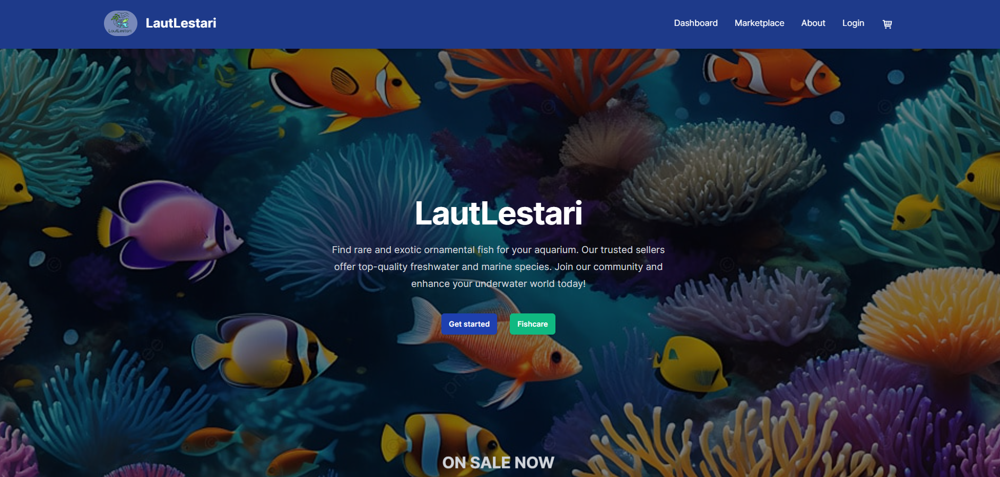

# LautLestari - FSSE Group I Final Project



**LautLestari** is the group final project for RevoU's Full-Stack Software Engineering (FSSE) Bootcamp, Group I. This project is a **community marketplace** designed for exotic fish enthusiasts, where users can browse, buy, and sell exotic fish. The main objective was to create a **Minimum Viable Product (MVP)** using the technologies and skills acquired during the bootcamp.

[Explore LautLestari](https://lautlestari.netlify.app/)  
*(Note: Due to the use of free services for the API, initial access may take a few moments.)*

[Link for the back-end repository](https://github.com/RWAndhika/LautLestari_BE)

## Technologies Used

### Front-end

- **HTML & CSS** (**Tailwind CSS**)
- **Next.js**

### Back-end

- **Flask**: Python web framework for the back-end API

### Services

- **Netlify**: For hosting the front-end
- **~~Heroku~~** => **Render.com**: For hosting the back-end API
- **Railway**: For database hosting

## Test Accounts

You can use the following accounts for testing:

### Seller

- **Email**: `test99@gmail.com`
- **Password**: `test123`

### Buyer

- **Email**: `test100@gmail.com`
- **Password**: `test123`

## Features Implemented

- **Marketplace Discovery**: Browse listings of exotic fish and view product details.
- **Product Listings**: Sellers can create and manage their listings.
- **User Authentication & Authorization**: Role-based protected routes for buyers and sellers.
- **Cart System**: Buyers can add items to their cart.

### Note

While a cart and transaction confirmation system is implemented, no actual payment gateway has been integrated. This decision was made due to project scope limitations, as payment gateways were not mandatory for the MVP.

## Installation and Setup

To run the project locally, follow these steps:

### Front-end:

1. Clone the repository.
2. Navigate to the `gfp-app` directory.
3. Install dependencies:

    ```bash
    npm install
    ```

4. Start the development server:

    ```bash
    npm run dev
    ```
